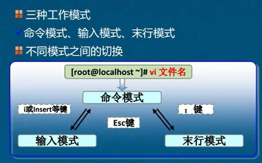

# vim
 vi的增强版；

- 命令模式
	* 打开文件后即进入命令模式
- 输入模式
	* 输入 i 或者 a 或者 按insert 即可进入输入模式 
- 末行模式
	- 在输入模式时按esc进入命令模式；
	- 在命令模式时输入 ：冒号，即可进入末行模式

### 命令模式
#### 行复制粘贴删除

- 复制操作
	- yy
		- 复制光标当前所在行
	- Nyy
		- 自光标行起，复制N行，如：2yy复制两行
- 粘贴操作
	- p(小写)
		- 在光标行后粘贴
	- P(大写)
		* 在光标行前粘贴
- 删除操作
	> 剪切后不粘贴即为删除
	- Del按键
		- 删除光标所在位置字符
	- dd命令
		- 删除光标所在行
	- #dd命令
		- 自光标行起，删除#行，如：2yy删除两行
	- d命令+左右
		- d之后按→箭头，删除光标右侧字符
	- d命令+上下
		- d之后按↑箭头，删除光标行和上面一行字符
#### 可视化复制
- ctrl+v
	- 进入可视化复制模式，然后按↑↓←→来调节选中区域，之后按yy即可完成复制
	- 按esc可退出
### 末行模式

- 另存为
	- :w /xxx/test2
		* 另存为xxx路径下名为test2的文件 
- 退出编辑
	- :q 
		- 未修改的情况直接退出
	- :q! 
		- 不保存已修改的内容直接退出
	- :wq
		- 保存已修改的内容并退出，（无论是否修改，文件的修改时间都会更新）
	- :x 
		- 智能退出，若修改则保存后退出，若未修改则直接退出（且不更新修改时间）
- 显示行号
	- :set nu 
- 撤销
	- :u
- 查找
	- :/xx
		- 查找xx，并高亮显示；
	- :nohl
		- 取消高亮，否则会一直高亮显示
		
# 创建文件
```
vim test // 创建文件名为test
```