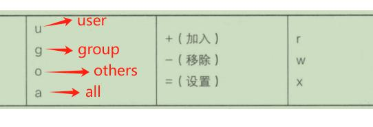

>Linux 一般将文件可读写的身份分为三个类别，分别是：拥有者(owner)、所属群组(group)、其他人(others)，且三种身份各有读(read)、写(write)、执行(execute) 等权限。其值分别为：4,2,1

- /etc/passwd 用来记录所有的用户信息（用户账号），
- /etc/shadow 这用来记录用户的密码（经过加密的密码），
- /etc/group 用来记录所有的分组信息（分组名）。

### 查看文件属性
```js
ll -a
//选项 -a 表示列出所有的文件详细的权限与属性，包含隐藏文件。文件名第一个字符为 [.] 的文件就是隐藏文件
```


	

- 文件类型
	- d 表示目录
	- \- 表示文件
	- l 表示链接文件(link file)
	- b 表示设备文件里面的可供存储的周边设备(可按块随机读写的设备 )
	- c 表示设备文件里面的串行端口设备，例如键盘、鼠标(一次性读取设备 )
> 第六栏为这个文件的创建日期或是最近的修改日期，这一栏的内容分别为日期(月/日)及时间，如果这个文件被修改的时间距离现在太久，那么时间部分会仅显示年份而已

> 第七栏为文件名，如果文件名之前多一个 [.]，则代表这个文件为隐藏文件。

### 修改文件属性、权限
#### chgrp： 修改用户组 
*被修改的组名必须要在 /etc/group 文件中存在*
```js
chgrp aaa demo.txt  #修改用户组为aaa
chgrp -R aaa demo  #递归(recursive)修改用户组为aaa
```
#### chown： 修改拥有者
*能同时修改用户组*
```js
// chown [-R] 账号名称 文件或目录
chown -R aaa demo.txt  //递归修改拥有者为aaa
// chown [-R] 账号名称:用户组名称 文件或目录
chown -R aaa:xxx demo.txt  //递归修改拥有者为aaa,用户组名称为xxx；
```
#### chmod： 修改权限

1. 数字修改
- *每种身份 (owner、group、others) 各自的三个权限 (r、w、x) 数字是需要累加的，例如当权限为：[-rwxrwx---] 数字则是:*
```js
owner = rwx = 4+2+1 = 7
group = rwx = 4+2+1 = 7
others= --- = 0+0+0 = 0
```
- 所以该文件的权限值为：770

2. 符号修改

- 见图


```js
// 使用=号
chmod u=rwx,go=rx demo.txt
// 使用-号
chmod a-x demo.txt 
```