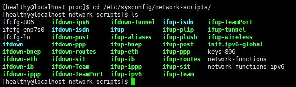

# 网卡相关
- 文件位置
	- /etc/sysconfig/network-scripts/
	- 文件格式: ifcfg-xxx;
		* xxx 是网卡名称；eth0、eth1等；
		 
		 


- 修改配置文件
	```
	DEVICE=网络接口名
	ONBOOT=网络接口是否在系统启动时激活
	BOOTPROTO=static|dhcp(网络接口的配置方式)
	```
- 其他配置项
	```
	IPADDR=网络IP地址
	NETMASK=子网掩码
	BOOTPROTO=static （静态ip）
	```
- 修改主机名称配置文件
	- 路径
		- /etc/sysconfig/network
	- 修改内容
		```
		NETWORKING=yes
		HOSTNAME=www
		```