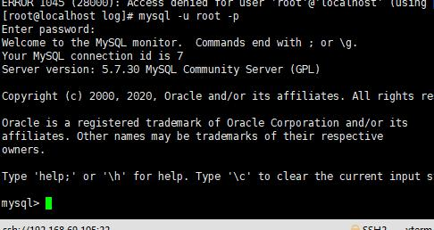

# 安装mysql

> 源文件地址：[http://repo.mysql.com/](http://repo.mysql.com/)

> 包地址：[https://downloads.mysql.com/archives/community/](https://downloads.mysql.com/archives/community/)

## 下载rpm包
- 选择下载位置
	- 可以home
- [libs依赖](http://repo.mysql.com/yum/mysql-5.7-community/el/7/x86_64/mysql-community-libs-5.7.30-1.el7.x86_64.rpm)
- [client依赖](http://repo.mysql.com/yum/mysql-5.7-community/el/7/x86_64/mysql-community-client-5.7.30-1.el7.x86_64.rpm)
- [common依赖](http://repo.mysql.com/yum/mysql-5.7-community/el/7/x86_64/mysql-community-common-5.7.30-1.el7.x86_64.rpm)
- [server](http://repo.mysql.com/yum/mysql-5.7-community/el/7/x86_64/mysql-community-server-5.7.30-1.el7.x86_64.rpm)

## 卸载安装错误的包
- yum 安装的
	- yum remove xxx
- rpm方式安装的
	-  sudo rpm -e --nodeps mysql-community-libs
- 查看rpm安装的
	- rpm -qa|grep mysql

## 安装步骤安装依赖

- common
	- sudo rpm -ivh mysql-community-common-5.7.30-1.el7.x86_64.rpm
		- （i表示安装，v表示显示进度，h表示替换为#显示）
- libs
	- sudo rpm -iv mysql-community-libs-5.7.30-1.el7.x86_64.rpm
- client
	- sudo rpm -ivh mysql-community-client-5.7.30-1.el7.x86_64.rpm

## 登录
- 获取初始密码
	- grep password /var/log/mysqld.log
		
- 重置密码
	- mysqladmin -u root -p password
	- 
	- @Str0ngSAPwd
- 登录
	- mysql -u root -p
	- 

## navicat连接
- 输入数据库用户名，密码
	
- 输入服务器登录用户名和密码
	