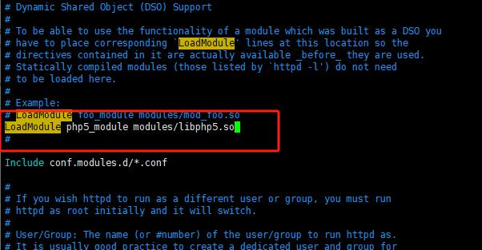
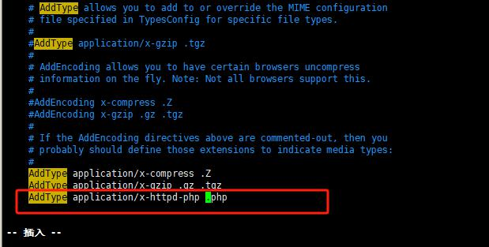
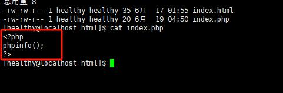
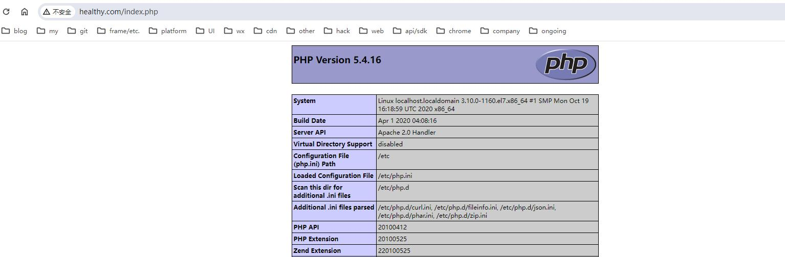

# PHP
> 超文本预处理语言，

## 安装
- sudo yum -y install php

## 下载地址
[https://www.php.net/](https://www.php.net/)

# 调整apache配置
> 加了php相关的模块，配置才能支持访问php

- php5_module
	- 找到config文件：/etc/httpd/conf/httpd.conf,并使用vim查询编辑
	- LoadModule php5_module modules/libphp5.so
	- 
- .php 类型支持
	- 还是这个config文件，重新查询编辑
	- AddType application/x-httpd-php .php
	- 
> ！！！注意。.php之前一定要有空格！

- 重启
	- service httpd restart

# 测试支持
- 添加php文件
	- vim /var/www/html/index.php
	- 

- 关闭防火墙
- 本地、或浏览器访问： 
- 

# php连接数据库
```php
<?php
$link=mysql_connect('localhost','root','@Str0ngSAPwd');
if($link)echo"OK!";
mysql_close();
?>

```
- 访问xxxxx
> 未成功，应该是php问题；（资料查证缺少mysql扩展，通过phpinfo可知扩展内容）