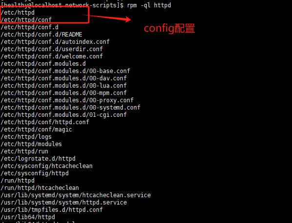
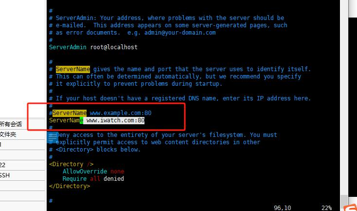
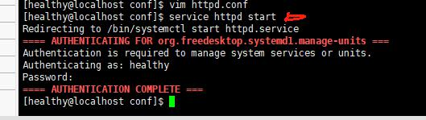
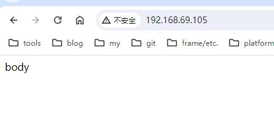

# Apache
> 首先安装httpd

## httpd
- 安装httpd
	- sudo yum install -y httpd 
- 配置httpd
	- 查询安装位置
		* rpm -ql httpd 
			
			
		- 目录位置为 /etc/httpd/conf/httpd.conf

	- 修改
	```js
		//找到 #ServerName www.exsample.com:80
		// 修改为自己的域名
		ServerName www.xxxxxx.com:80
	```
	
	- 启动httpd服务
		- service httpd start
		
- 测试httpd
	- 新建测试文档
		- 路径：/var/www/html/index.html(使用vim，内容自理)
	- 安装lynx（字符浏览器）
		- sudo yum install -y lynx
	- 访问
		- lynx http://127.0.0.1
	- 关闭防火墙
		- systemctl stop firewalld.service（7.0之前防火墙服务为iptables）
	- 浏览器访问ip
	- 

	- 启动防火墙
		- systemctl start firewalld.service（7.0之前防火墙服务为iptables）


- 查询是否已安装
	* rpm -q httpd
