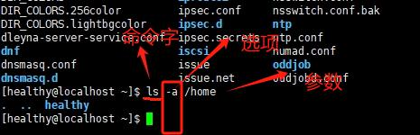
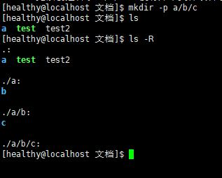
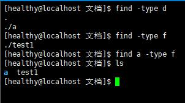
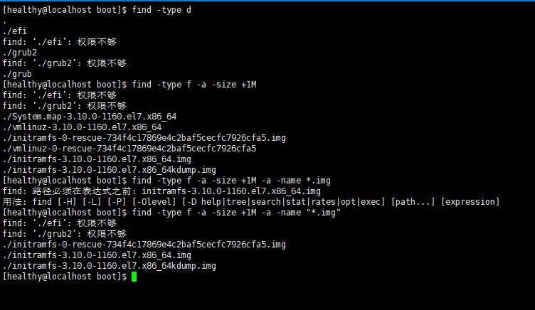

# 常用命令
##  基础
> 指令-》解释器（bashshell)-》内核-》硬件
- 分类
	- 内部命令（解释器的一部分）
	- 外部命令，独立于shell解释器之外的程序

- 组成
	- 命令字【选项】【参数】  (ls -a)(ls --help)
	- “-” 引导短格式选项
	- “--” 引导长格式
	- 参数

##  一般技巧
- tab键： 自动补齐（按两次列出所有相关命令）
- 反斜杠 “\”: 强制换行
- ctrl+c: 取消当前命令；
- ctrl+L: 相当于clear，清屏；
- ctrl+u: 删除光标之前命令；
- ctrl+k: 删除光标之后的命令；

##  获取命令帮助
- help(查看内部命令的帮助信息)
	- help cd :查看cd命令的帮助；
- --help(查看大部分外部命令)
- man：命令阅读手册：
	- man cd: 查看cd命令的手册；
	- “/” :查找
		- n/N ：查看下一个/上一个匹配项；

##  ls（list）命令详解
- ls -l [/etc[/*.conf]]: 查看文件详细信息
- ls -a []:列出全部
- ls -A []:不显示隐藏目录：".",".."
- ls -h []:人性化，一般和L一起使用；
	- ls -lh []
- ls -R [/home]: 递归的形式展开
> 命令可以结合使用： ls -lR /home;

## du (disk usage) 命令详解
> 统计目录、文件占用的磁盘空间；
- du -a []: 统计所有；
- du -h []: 人性化
- du -s []：只统计总占用大小（summary）
> 命令可以结合使用：su -hs /home;

##  touch 命令
> 创建空文件、修改属性
- touch test;
	- 创建test文件，如果文件已存在，则修改时间标记；
** 略过 **
##  mkdir （make directory)
> 创建新目录: mkdir [opiton] 目录位置及名称
- mkdir -p a/b/c : 嵌套创建目录

##  cp(copy)
> 复制文件或者目录：cp [option] from to;

- options
	- -f: 强制覆盖、复制；
	- -i: 覆盖前提醒
	- -p: 复制时保留源文件权限等属性信息不变；
	- -r： 递归复制文件及目录（复制目录时必须）；

##  rm(remove)
> 删除指定的文件、目录：rm [option] file/dir

- options
	- -f: 强制
	- -i:  交互
	- -r:  递归
##  mv(move) 剪切、重命名
> 剪切 文件、目录；（目录位置不变的话相当于重命名）
- mv from to
	- 不需要递归命令即可移动目录；
- mv name1 to/name2:
	- 移动的同时，重命名；
##  which
> 查看命令所在目录：which 命令|程序名;
> 在echo $PATH目录内查找到第一个后，停止；
- which -a mv; (-a)在所有目录查找；
	- -a 只能查找内部命令

## find
> 精细查找： find [范围][条件]

- 条件
	- -name： *、？
		- find /etc -name *resol*.conf 
			- * 表示{0，}；任意多个字符
		- find /etc -name resol?.conf
			- ? 表示{1,1}
	- -size : 大小；（+-）
		- find /boot -size +10M
			- 查找大于10兆的文件；
		- find /boot -size -10M
			- 查找小于10兆的文件；
	- -type: 类型
		- f：普通文件
		- d：目录
		- b： 块设备文件（硬盘）
		- c： 字符设备文件（键盘）
		
- 条件联合
	- -a（and)
	- -o (or)
	- find /boot -size +1M -a -name "vm*"
	- find /boot -size +1M -o -name "vm*"
