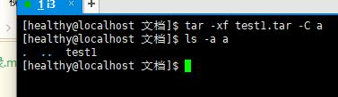

# cat

> cat [option] filename

- cat /etc/hosts
- cat /etc/hosts /etc/xxx
	- 可以同时将两个文件同时展示；

- option
	- cat -n test: 同时显示行号；
	- cat -A test: 同时显示特殊字符/全部显示；

# more
> 全屏分页显示文件内容： more [option] filename

- Enter回车 ： 向下滚动
- Space空格： 翻页

*不能网上翻，option一般不用*

# less
> more的扩展；有更多功能：less [option] filename

- Enter回车 ： 向下滚动
- Space空格： 翻页
- ↑↓箭头：上下滚动
- PageUp，PageDown： 上下翻页
- “/”: 查找： /xxx
	- "n": 下一个
	- "N": 上一个

# head/tail
> 查看文件的开头、结尾的内容（默认10行）：head [option] filename

- option
	- head -20 /etc/xxxx: 显示前面20行；
	- tail -20 /etc/xxxx: 显示后面20行；
	- tail -f test1 : 可以监听文件的实时更新；

# wc
> 统计文件内容(word count) wc [option] filename

- option
	- -l: 统计行数
	- -w: 统计单词个数
	- -c: 统计字节数


# 管道：“|”
> 像管道一样连接前后的命令，后面可以处理前面的结果：find xxx | wc -l
### wc的升级用法
- 查看用户账号数量
	- wc -l /etc/passwd
- 查看有多少conf文件
	- sudo find /etc -name "*.conf" | wc -l


# grep（过滤）
> 查找文件过滤显示： grep [option] [condition] filename

- option
	- -i: 忽略大小写
	- -v: 反向查找
```bash
grep -i test1
grep -iv test1
```
- condition
	- ^xxx: 以xxx开头
	- xxx$: 以xxx结尾
	- ^$: 表示空行（中间什么都没有）


> cat -A 会显示$;$即表示空行；

# gzip/gunzip（压缩、解压）
- 压缩：gzip [-n] filename; 
	- n:1-9;数字越大，压缩级别越高；
- 解压：gzip -d filename 
	- (gunzip  === gzip -d)
> 压缩扩展名：.gz;压缩后源文件会消失；


# bzip2/bunzip2(压缩、解压)

> 用法同上；压缩扩展名：.bz2

# tar (归档)
> 制作归档文件：tar [option] newFilename filename/dirname
> 释放归档文件: tar [option] tarfilename filename/ -C dirname

- option
	- -c ：创建.tar 格式文件（必须)
	- -x : 解开.tar 格式文件；
	- -v : 输出详细信息；
	- -f ：使用贵方文件（必须，且为option最后一项）
	- -p ：保留原始权限（不建议，解压时会有问题）
	- -t : 列表查看文件
	- -C ：解包时指定的释放文件夹
	- -z : 调用gzip，制作tar文件时进行压缩；解开tar文件时进行解压（同时扩展名手动调整为gz)
	- -j : 调用gzip，制作tar文件时进行压缩；解开tar文件时进行解压（同时扩展名手动调整为bz2)


