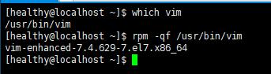
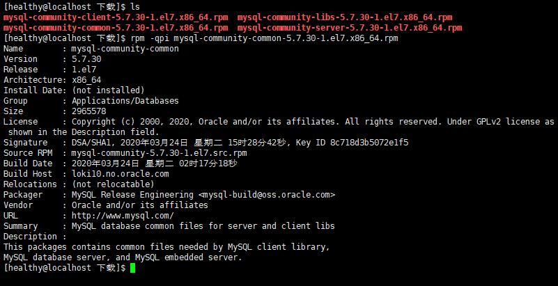
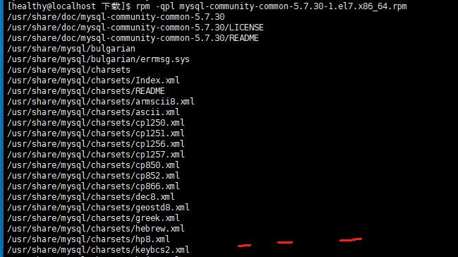
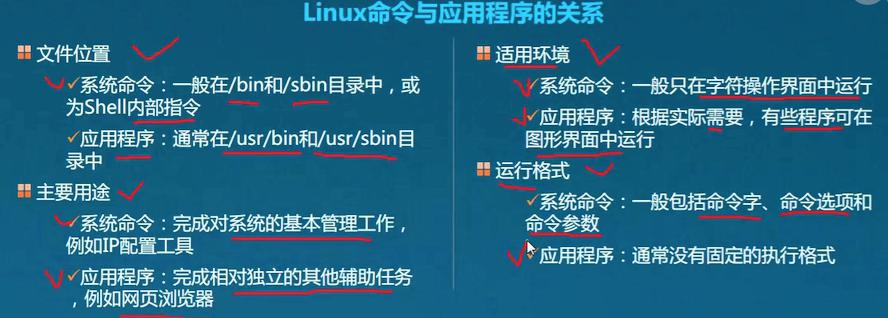
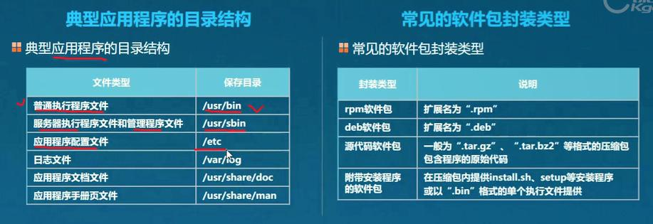
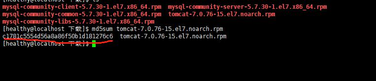
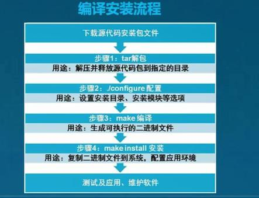

# RPM 包管理工具
- RPM包一般命名格式
	- bash-4.1.2-15.el6_4.x86_64.rpm
	- bash - 4.1.2- 15     .el6        _ 4.x86_64.rpm
	- 名称  -版本号- 发布次数.操作系统类型_硬件平台.扩展名

## 查询软件信息
> rpm -q[子选项] [软件名] : -q === query

- 子选项
	- -qa：查看安装的所有rpm软件包列表
	- -qi：查看指定软件的详细信息
	- -ql： 查看软件包安装的目录、文件列表
- 查询xxx是否已安装
	- rpm -qa | grep xxx
	- rpm -q xxx

## 查询某文件属于哪个rpm软件

> rpm -qf filename/dirname

- 查询vim功能是哪个软件提供的
	- rpm -qf /usr/bin/vim

## 查询未安装的rpm软件信息

> rpm -qp[子选项] filename；

- 子选项
	- i： -qpi: 查看详细信息
	- l（L的小写）： -qpl： （小写）查看所包含的文件列表、目录

## 安装、升级rpm软件
> rpm [option] rpmname [--force] [--nodeps];force是忽略版本大小，nodeps是忽略依赖

- option
	- -i: 安装一个新的
	- -U: 升级，若未安装，则安装；
	- -F: 升级，若未安装，则放弃；
	- -v：显示安装过程详细信息
	- -h: 以“#”显示安装进度，常和v同时使用；

## 卸载RPM 软件
> rpm -e softwarename [--nodeps]; (eraser:橡皮;nodeps:安装、卸载等操作时忽略依赖关系) 

## 解决依赖关系：

- 安装
	- 被依赖的先安装：(A依赖B；先安装B)
	- 同时指定多个包进行安装
- 卸载
	- 依赖其他的，先卸载(A依赖B；先卸载A)
	- 同时卸载多个；
- 忽略依赖
	- “--nodeps”;(nodepends不推荐)

## RPM数据库
> 本机维护的rpm库有可能出异常(无法使用rpm命令)，可以进行重建
### 重建rpm数据库
- rpm --rebuilddb
### 初始化rpm数据库
- rpm --initdb
# yum工具
> 不关心依赖关系

# 源码包安装
- 基础

## 计算源码文件的md5值
- md5sum filename
- 

## 编译工具

- gcc
- make

## 编译步骤

- 1、解包
	- 一般放到/usr/src/下
	- /usr/src/name-version/
	- 例：tar zxf httpd-2.2.1.tar.gz -C /usr/src/
- 2、配置
	- 进入解包的目录找到configure脚本
	- “./configure --help” 可以查看帮助，查看都有哪些配置
	-  典型配置：--prefix=安装目录
	-  例：
		- 1、cd /usr/src/name-version/
		- 2、./configure --help ：来查看
		- 3、./configure --prefix=/usr/local/xxx :来指定安装目录
			- 不写参数配置会有默认值；
- 3、编译、
	- make ；（在解包的目录执行)
- 4、安装
	- make install （在解包的目录执行)