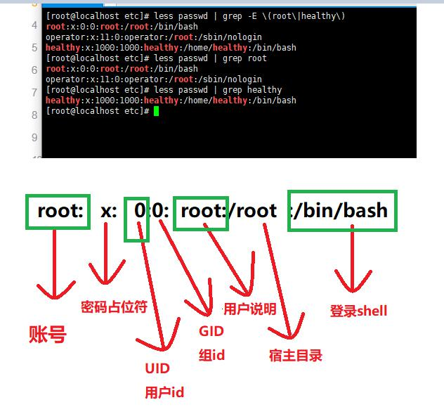
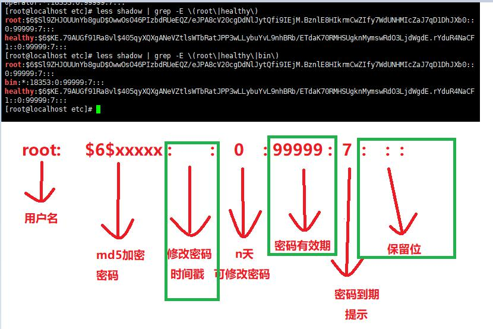
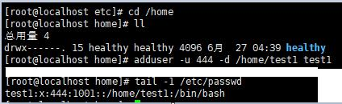
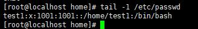
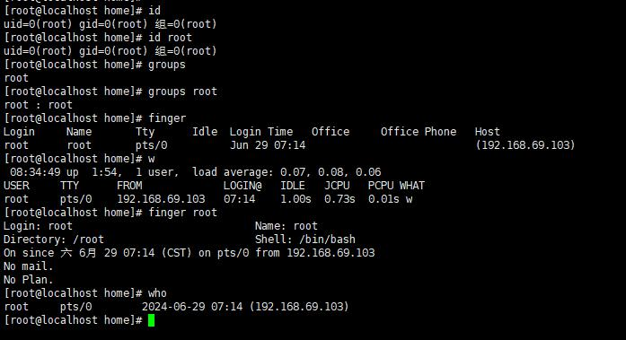

# 账号管理

## 管理账号
- **用户分类**
	- 超级用户：root（一般不用）
	- 普通用户： 一般都用这个，必要时切换至root
	- 程序用户： 默认都会创建，用户权限低
- UID
	- 用户表示：每个用户都会有
- 账号文件
	- /etc/passwd (现在已经不保存密码，只要账号)
		- 用户名称
		- 宿主目录
		- 登录shell等信息

> 此文件应该定期备份


- 账号说明
	- UID 用的多
	- shell： 用的多
	- 描述： 一般不写
	- 宿主目录： 登录进来之后进入的地方
	- 密码占位符： 已经不存目录，只占位
- 密码文件
	- /etc/shadow
	- 用户名
	- md5加密后的密码
	- 修改密码的天数时间戳
	- n天后可以再次修改密码；0表示可以随时修改
	- 密码有效期天数
	- 密码过期n天提示
	- 保留位


## 添加用户
> 使用命令：useradd [option] username   adduser是useradd的快捷方式
> 默认会创建一个和username相同的用户组；指定已存在的用户组：useradd [option] [-g user_group] username

- option
	- -u 指定UID
	- -d 指定宿主目录， 默认 /home/'username'
	- -e 指定失效时间
	- -M 不为用户创建宿主目录（账号不需要登录的时候可以这样用-->程序用户）
	- -s (shell)指定可以登录的shell；（/sbin/nologin->指定次shell表示不可登录)
	```bash	
		useradd -u 444 -d /home/test1 -s /bin/bash test1
	```
	
	
## 初始化用户配置

> 创建用户后，会默认从 /etc/skel 复制内容到宿主目录下（skeleton）；
> 这些初始化的文件，会在登录和注销时进行读取；

- ~/.bash_profile :每次登录时执行，想要的开机特性可以加入到文件中
- ~/.bashrc :每次进入新的bash环境时执行
- ~/.bash_logout :每次退出时执行

*~表示家目录；如果文件丢失后可以从骨架目录重新复制过来*


## 设置修改用户密码

> 新用户无密码时，无法登录： 修改密码：passwd [option] [username];不输username即给当前用户修改。（只有root账户才可以指定username）

- passwd username : 修改密码时不需要option；

- option
	- -d :清空用户的密码，使之不需要密码登录
	- -l : 锁定用户（lock）
	- -S :（大写）查看用户状态（是否被锁定）
	- -u : 解锁用户账号 

## 修改用户属性
> usermod [option] username

- option
	- -l: 更改用户的登录名称
		- usermod -l newname oldname
	- -L：锁定用户账户
	- -U：解锁
	- -u、-d、-e、-s

## 删除用户
> userdel [-r] username  :-r,会同时删除宿主目录

- 理论上，删除前先锁定用户一段时间；

# 用户组


- 分类
	- 基本组（私有组）
		* 不指定组时，会默认创建和用户名相同的组，只有一个用户；
	- 附加组（公共组）
		- 创建用户时可以指定多个组；
	
	- 
		- 这里出现的GID都是基本组，不在这里出现的都是附加组
- 组织标识
	- GID （权限基本通过id来判断）

- 相关文件
	- /etc/group  组基本信息
	- /etc/gshadow 密码信息（之前有组管理员、现在都是通过管理员管理）

## 添加组

> 格式：groupadd [-g GID] group_name;添加用户[可以指定组id]

- groupadd -g 333 market
	- tail /etc/group 查看；
	- market:x:333:; 组名：密码：GID：包含的组员（附加组）
## 增、删组员
> gpasswd：早期用来设置组密码，基本已经不用。现在用来增、删组成员；gpasswd [option] group_name

- option
	- -a: (add) 向组内添加用户
		- gpasswd -a username group_name
	- -d： 从组内删除用户
		- gpasswd -d username group_name
	- -M： 定义成员列表，以逗号分隔
		* gpasswd -M username1,username2 group_name

## 删除组
> 删除前确实是否有用到，删除组会把内部组员释放出去：groupdel group_name
> 基本组不可删除,用户删除后才可删除；

## 添加用户到指定组
> 1、通过useradd添加用户时直接指定组名或者GID；
- useradd -g 基本组[名/id] -G 附加组[名/id]
	 
## 修改用户的用户组的属性
> 从用户角度，修改用户组信息；格式： usermod [option] group_name

- option
	* -g : 修改用户组的基本组名或GID
	* -G : 修改用户组的附加组名或GID
```bash
usermod -g group_name -G group_id username
```

## 查看用户的信息

- id:用户的身份标识
	- id [username]
- groups:查看用户所属组
	- groups [username] 
		- 有个sss，因为可以属于多个组
- finger: 查询用户详细信息（需要安装,属于系统管理命令）
	- finger [username]
- w: 查询已经登录的主机用户信息
	- who、w

```bash
[root@localhost home]# id 
uid=0(root) gid=0(root) 组=0(root)
[root@localhost home]# id root   # 也可以查询xxx用户是否存在
uid=0(root) gid=0(root) 组=0(root)
[root@localhost home]# groups
root
[root@localhost home]# groups root
root : root

[root@localhost home]# finger
Login     Name       Tty      Idle  Login Time   Office     Office Phone   Host
root      root       pts/0          Jun 29 07:14                           (192.168.69.103)
[root@localhost home]# finger root
Login: root           			Name: root
Directory: /root                    	Shell: /bin/bash
On since 六 6月 29 07:14 (CST) on pts/0 from 192.168.69.103
   2 seconds idle
No mail.
No Plan.


[root@localhost home]# w
 08:32:08 up  1:52,  1 user,  load average: 0.08, 0.11, 0.07
USER     TTY      FROM             LOGIN@   IDLE   JCPU   PCPU WHAT
root     pts/0    192.168.69.103   07:14    0.00s  0.71s  0.01s w
[root@localhost home]# who
root     pts/0        2024-06-29 07:14 (192.168.69.103)

```

