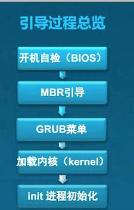
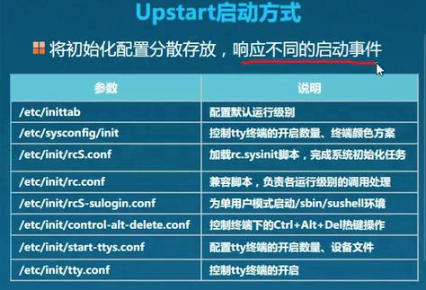
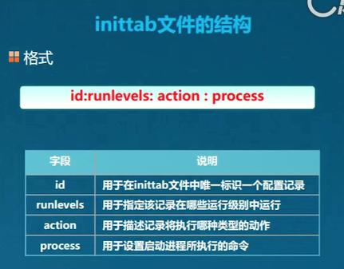
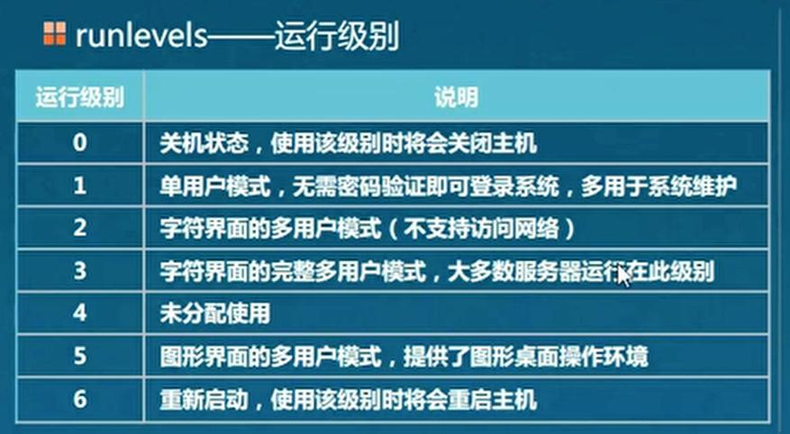
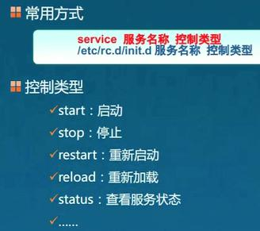
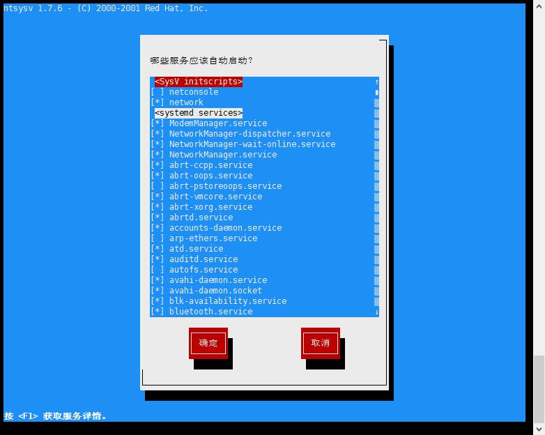

## 引导过程
- 过程
	- 开机BIOS硬件自检
	- MBR引导，查找GRUB引导程序，分区表信息
		- 启动GRUB程序，读取grub.conf文件
	- GRUB
		- grub.conf记载了内核位置，镜像文件系统位置；-》然后去加载内核
	- 加载内核
		- 进行全面的硬件检测 -》然后去启动第一个进程
	- 启动init进程
		- 进行系统的初始化

- init 进程
	- 由linux内核加载运行
	- 位置：/sbin/init
	- 系统第一个进程
	- PID永远为1；

- 启动方式
	- Upstart启动方式  （centos6开始采用此方式)
	- 

	
	
- inittab 文件结构
	- 此方式，已启用
	- 

	- 运行级别
		- 
> 因，centos7已经弃用，停止记录；

## 服务控制；
> centos7 仍然兼容此种命令

- 控制类型
	- restart ： 先停止然后启动服务；
	- reload： 重新加载；

- TODO：centos7的systemd；

## 优化启动过程

### 工具分类
- ntsysv工具
	- 图形管理工具
	- 便于管理多个服务
	- ↑↓、空格、tab、enter结合操作；
	- 
- chkconfig工具
	- 字符管理工具
	- 管理单个服务效率更高

### ntsysv
> 默认列出全部服务，根据级别显示，格式：ntsysv --level 级别列表

- ntsysv --level 5
	- levels[016],未发现区别
	- 
### chkconfig
- chkconfig --list
> 该输出结果只显示 SysV 服务，并不包含原生 systemd 服务。
> 要列出 systemd 服务，请执行 'systemctl list-unit-files'。

TODO: 补充7版本操作方式；