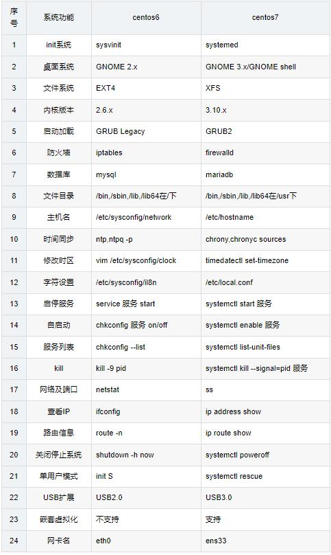

## 1、系统类型
- centos6的系统类型是sysvinit（sysvinit是system V的init系统）

- centos7的系统类型是systemd（systemed是linux系统最新的初始化系统intt，systemed的设计目标是克服sysvinit固有的缺点，从而高效提升系统的启动速度）。

- 可以通过pstree -p查看系统类型，centos6的第一个进程是init（pid=1），centos7的第一个进程为systemd（pid=1）

- centos6是按一定顺序启动，启动很慢；centos7是并行启动，启动速度快其实centos6和7很多不同之处都是和系统类型sysvinit/systemd有关系。
 
## 2、服务管理 
- centos6：采用的是service和chconfig管理服务（service 服务 start/stop/restart/status/reload）
- centos7：采用systemctl管理服务，但是还可以使用service和chconfig命令（systemctl start/stop/restart/reload 服务）
## 3、文件系统
- centos6.X：文件系统默认是EXT4（Fourth EXtended filesystem），EXT4的单个文件系统容量达到1EB（1,048,576TB，1EB=1024PB，1PB=1024TB），单个文件大小则达到16TB(4K block size)；可支持无限数量的子目录。
- centos7.X：文件系统默认是XFS，xfs是一个64文件系统，XFS默认最大支持8EB减1字节的单个文件系统，实际部署时取决于宿主机操作系统的最大块限制；最大可支持的文件大小为9EB，最大文件系统大小为18EB。
- 可以使用 blkid /dev/sda1 查看文件系统
	- ```bash
	[root@centos7 ~]# blkid /dev/sda1
	/dev/sda1: UUID="d617fdc4-033b-431e-96d5-b106bbc9461d" TYPE="xfs" 
	```
## 4、文件结构
- centos6：/bin、/sbin、/lib、/lib64在/下
- centos7：/bin、/sbin、/lib、/lib64在/usr下
## 5、桌面系统
- centos6：GNOME 2.x
- centos7：GNOME 3.x（GNOME Shell）
## 6、主机名
- centos6：配置文件为/etc/sysconfig/network（永久设置）
- centos7：配置文件为/etc/hostname（永久设置）还可以使用命令永久设置：hostnamectl set-hostname 主机名 #hostname是新增的主机名管理工具
## 7、查看系统版本
- redhat系列的（centos）都可以使用 cat /etc/redhat-release

- centos7还可以使用 cat /etc/os-release 支持所有systemd系统的统一发行版本名称和版本号文件，测试ubuntu16和18都可以使用这样；也可以使用 cat /proc/version 查看系统版本

## 8、时间同步
- centos6：使用的是ntp
- centos7：使用chrony也可以使用ntp
## 9、防火墙
- centos6：iptables防火墙
- centos7：firewalld防火墙
## 10、登录提示语
- cat /etc/issue #有些生产环境会清空此文件，具体情况具体分析
- [root@centso7 ~]# cat /etc/issue

## 11、字符集
- centos6：使用 /etc/sysconfig/i18n
- centos7：使用 /etc/local.conf
- centos7还可以使用字符集管理工具localectl设置，localctl set-locale LANG=zh_CN.UTF-8 #localectl 是新增的字符管理工具
 ```bash
 [root@centos7 ~]# cat /etc/locale.conf 
 LANG="zh_CN.UTF-8"
 ```
## 12、时区设置 
- centos7： 需使用timedatectl来设置
## 13、地区设置
## 14、grub（GRand Unified Bootloader）
- centos6：使用grub
- centos7：使用grub2
- 配置文件的名称改变了，在grub中，配置文件为grub.conf或menu.lst（grub.conf的一个软链接）grub2中改名为grub.cfg。
## 15、内核

## 16、数据库
- centos6：默认数据库是MySQL
- centos7：默认是数据库是MariaDB
## 17、网卡名
- centos6：网卡名是eth0
- centos7：网卡名是ens33
## 18、嵌套虚拟化技术
- centos6：不支持
- centos7：支持
## 19、USB扩展
- centos6：USB2.0
- centos7：USB3.0 

