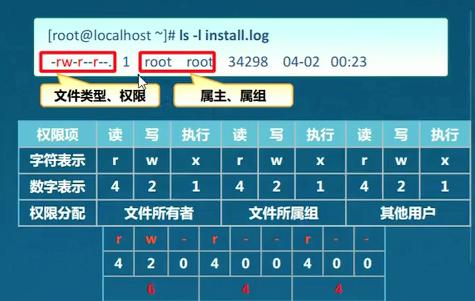
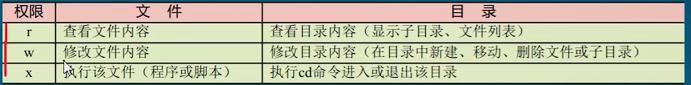

# 权限及归属
> 文件、目录的权限和归属

## 文件的权限和归属
- 权限
	- r：读取，查看
	- w：写入，修改
	- x：执行、运行
- 归属
	- 属主：用户
	- 属组： 用户组

- 文件信息
```bash
-rw-rw-r-- 1 healthy healthy 57 6月  26 05:09 test1
类型、权限、硬链接数 属主 属组
```


### 设置文件权限
> 格式：chmod [ugoa] [+-=] [rwx] filename; chmod nnn filename;

1. 数字修改
- *每种身份 (owner、group、others) 各自的三个权限 (r、w、x) 数字是需要累加的，例如当权限为：[-rwxrwx---] 数字则是:*
```js
owner = rwx = 4+2+1 = 7
group = rwx = 4+2+1 = 7
others= --- = 0+0+0 = 0
```
- 所以该文件的权限值为：770

2. 符号修改

- 见图


```js
// 使用=号
chmod u=rwx,go=rx demo.txt
// 使用-号减少权限
chmod a-x demo.txt 
```

### 修改文件归属用户
> 格式：chown username filename;
> chown :group_name filename;
> chown username:group_name filename

- chown root 1.txt (改变所属用户)
- chown :root 1.txt（改变所属组）
- chown root:root 1.txt (同时改变用户所属组及所属用)

### 修改用户组
> 格式：chgrp [-R] group_name filename 

```bash
 chgrp aaa demo.txt  #修改用户组为aaa
 chgrp -R aaa demo  #递归(recursive)修改用户组为aaa
```

## 目录的权限和归属

> *没有的权限是对目录内的文件及目录的权限；*
```bash
mkdir -p a/b/c
ll -R a
```
### 改变目录的权限
> 格式：chmod [-R] [ugoa] [+-=] [rwx] dirname;chmod [-R] nnn dirname;

- chmod 777 -R a
- chmod -R u=rwx a

### 设置目录的归属
> 格式：chown [-R] username dirname;
> chown [-R] :group_name dirname;
> chown [-R] username:group_name dirname

- -R : 递归；

> 特殊权限、重要权限，应该建立表格，时常关注查看。


## 权限掩码umask
> 设置文件或者目录的默认权限；
> 控制新建文件、目录的权限；（新建）
> 默认权限值 减去 umask的值，则为新建文件、目录的权限
- 查看
```bash
umask
# 0022； 第一位为特殊权限（也是4+2+1），其他和上面对应
```
- 修改
```bash
umask 022  # 需要被减去的权限值；
# 文件默认权限为：666；新建则为：644；目录默认权限为777；
```
