# 磁盘管理

### 基础知识
- 磁盘接口类型
	- IDE（并口）已淘汰
	- SATA（串口）现在的机械硬盘
		- 8字节一个一个的传输数据
		- 速度快
		- 纠错能力强（某个位传错了，可以识别并自动校正）
	- SCSI（主要用于服务器）
		- 转速快
		- CPU占用资源低
		- 支持热插热拔
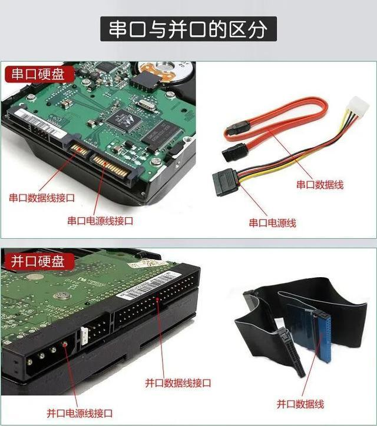
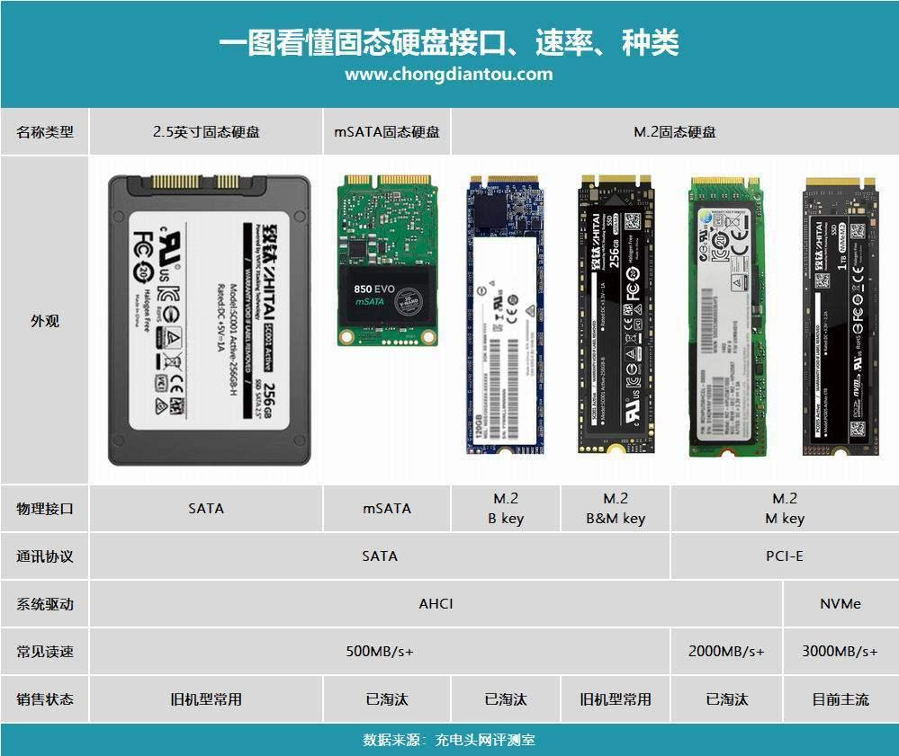
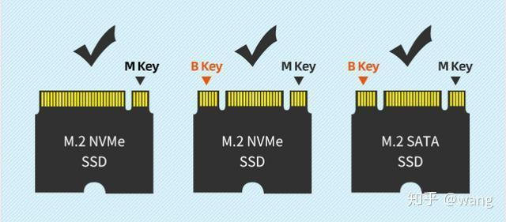
- 磁盘结构
	- 多个盘片
		- 盘片 -> 两个盘面（每面一个磁头）
			- 盘面 -> 多个磁道
				- 磁道 -> 多个扇区（每区512字节）
> 多个盘片，同半径的磁道构成多个柱面；（！分区以柱面为单位）
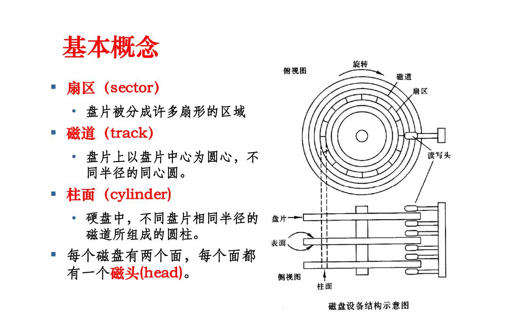

### 命令
> fdisk -l 查看
- /dev/sda1
	- 接口类型：
		- hd：表示IDE设备
		- sd：表示scsi设备
	- 硬盘顺序
		- a
		- b
		- ...
	- 分区顺序
		- 1
		- 2
		- ...

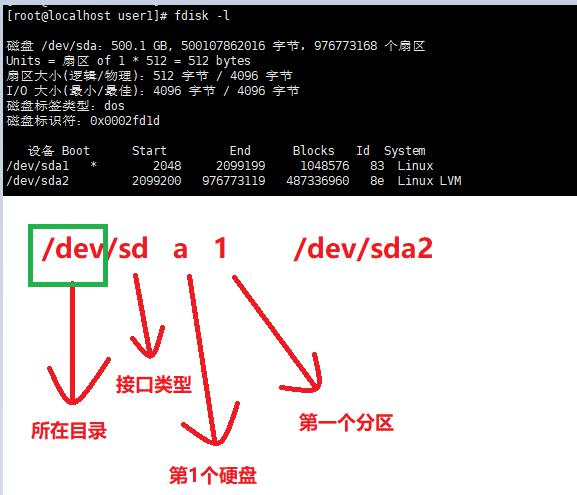


### MBR
> Master Boot Record: 主引导记录；
> 位于硬盘的第一个物理扇区-> C/H/S地址的0柱面0磁头1扇区，也叫做MBR扇区（512字节）；

- MBR包含内容
	- 硬盘分区表
	- 主引导程序
- MBR详细内容
	- 首先是446字节主引导程序
	- 其后跟4个分区记录，每个记录16个字节（共使用64字节）；
	- 最后两个结束标志签名字节（0x55,0xAA）
	- 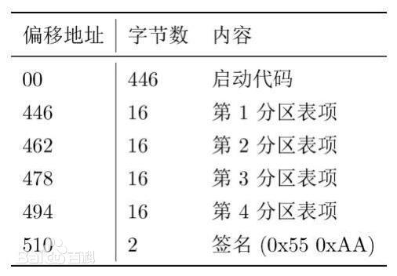

> 因mbr扇区大小限制，分区最大仅支持2T，大容量系统被UEFI+GPT取代; （UEFI+GPT => 略）

## 分区结构
> 1、主分区+扩展分区最多只有4个（主分区一般是系统）
> 2、扩展分区可以分为多个逻辑分区（序号从5开始）

**分区结构示意图**

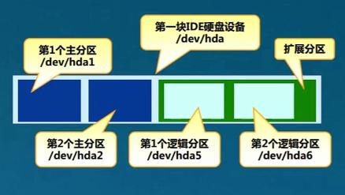
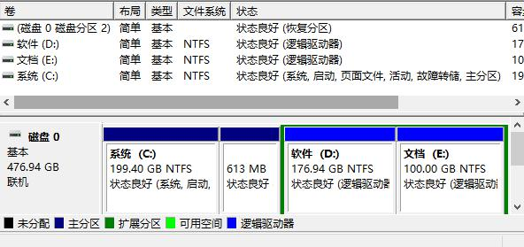

### 格式化
> 格式化为文件系统类型；linux可以通过虚拟文件系统接口识别各个类型；
- 支持的类型--》
	- EXT4  （第四代扩展文件系统（Extend）） 
		- centos6， 默认使用此类型
		- 存放文件和目录数据的分区
		- 典型的日志型文件系统
			- 写入文件数据时会先写入日志区内中，然后写入磁盘；断电可以从日志区恢复；
		- （不指定类型时）默认使用的文件系统；
	- SWAP （交换文件系统）
		- 内存中不常使用的内容，可以转入交换分区，腾出内存（需要时再调用）
		- 为Linux系统建立交换分区；（一般为内存的1.5-2倍，redhat推荐最大16g）
	- FAT16
	- FAT32
	- NTFS ： 需要安装ntfs-3g模块来识别，或者重新编译linux内核；
	- XFS
		- centos7默认使用此类型
		- 一种高性能的日志文件系统,适用于大容量存储和大文件
		- 高性能
		- 日志功能
		- 大容量支持
	- JFS
	- ...

## 管理磁盘及分区
### 检测并确认新硬盘 
> 添加新硬盘，关闭电源然后插入硬盘，启动；

- fdisk -l => 查看所有硬盘分区参数
	- 设备、Device: 设备名称  /dev/sda1 
	- Boot ：是否引导分区，“*”表示是引导分区；
	- start/end: 分区的起始/结束位置（扇区数）
	- Blocks： 块数，每块默认1024字节
	- Id： 分区对应的系统ID号
		- 83 ： 表示Linux中的Ext4分区
		- 8e ： 表示LVM逻辑卷
	- System： 分区类型
	```bash
	   设备     Boot      Start     End      	 Blocks   	 Id  System
	/dev/sda1    *        2048     2099199     1048576   	 83  Linux
	/dev/sda2             2099200  976773119   487336960   8e  Linux LVM

	Disk /dev/sdb doesn't contain a valid patition table
	# 新磁盘，未包含有效的分区表（未分区的新盘）
	```
- fdisk -l /dev/sda1 
	- 查看指定分区

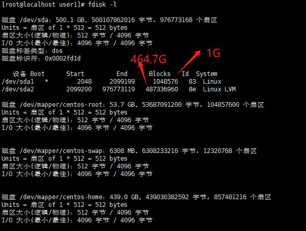

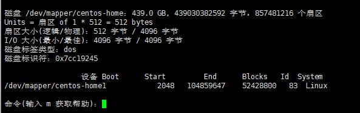


### 分区操作(增删改查)
>  在交互式的操作环境中管理磁盘分区；格式：fdisk [diskname]
>  加上option  -l 是查看；
>  不添加option是进入交互式管理分区模式；

- 交互指令
	- m：查看帮助信息
	- p：查看分区信息
	- n：新建分区
	- d：删除分区
	- t：变更分区类型
	- w：保存分区设置并处退
	- q：放弃分区设置并退出

```bash
fdisk /dev/mapper/centos-home
n
p
```

### 规划分区
> 尝试：两个主分区，各100G；剩余的都是扩展分区，其中两个逻辑分区，20G、和剩余；第一个改为swap类型

```bash
fdisk /dev/mapper/centos-home

命令(输入 m 获取帮助)：n
Partition type:
   p   primary (0 primary, 0 extended, 4 free)
   e   extended
Select (default p): p			#选择主分区
分区号 (1-4，默认 1)：1
起始 扇区 (2048-857481215，默认为 2048)：2048
Last 扇区, +扇区 or +size{K,M,G} (2048-857481215，默认为 857481215)：+100G   #分区大小改为100G
分区 1 已设置为 Linux 类型，大小设为 100 GiB

命令(输入 m 获取帮助)：n
Partition type:
   p   primary (1 primary, 0 extended, 3 free)
   e   extended
Select (default p): p
分区号 (2-4，默认 2)：2
起始 扇区 (209717248-857481215，默认为 209717248)：
将使用默认值 209717248
Last 扇区, +扇区 or +size{K,M,G} (209717248-857481215，默认为 857481215)：+100G
分区 2 已设置为 Linux 类型，大小设为 100 GiB

命令(输入 m 获取帮助)：n
Partition type:
   p   primary (2 primary, 0 extended, 2 free)
   e   extended
Select (default p): e	#新建扩展分区
分区号 (3,4，默认 3)：3
起始 扇区 (419432448-857481215，默认为 419432448)：#使用默认值
将使用默认值 419432448
Last 扇区, +扇区 or +size{K,M,G} (419432448-857481215，默认为 857481215)：
将使用默认值 857481215
分区 3 已设置为 Extended 类型，大小设为 208.9 GiB

命令(输入 m 获取帮助)：n	#在扩展分区的基础上选择逻辑分区
Partition type:
   p   primary (2 primary, 1 extended, 1 free)
   l   logical (numbered from 5)
Select (default p): l
添加逻辑分区 5
起始 扇区 (419434496-857481215，默认为 419434496)：
将使用默认值 419434496
Last 扇区, +扇区 or +size{K,M,G} (419434496-857481215，默认为 857481215)：+20G
分区 5 已设置为 Linux 类型，大小设为 20 GiB

命令(输入 m 获取帮助)：n
Partition type:
   p   primary (2 primary, 1 extended, 1 free)
   l   logical (numbered from 5)
Select (default p): l
添加逻辑分区 6
起始 扇区 (461379584-857481215，默认为 461379584)：
将使用默认值 461379584
Last 扇区, +扇区 or +size{K,M,G} (461379584-857481215，默认为 857481215)：
将使用默认值 857481215
分区 6 已设置为 Linux 类型，大小设为 188.9 GiB

命令(输入 m 获取帮助)：t			#修改第一个逻辑分区为swap交换类型
分区号 (1-3,5,6，默认 6)：5
Hex 代码(输入 L 列出所有代码)：L

 0  空              24  NEC DOS         81  Minix / 旧 Linu bf  Solaris        
 1  FAT12           27  隐藏的 NTFS Win 82  Linux 交换 / So c1  DRDOS/sec (FAT-
 2  XENIX root      39  Plan 9          83  Linux           c4  DRDOS/sec (FAT-
 3  XENIX usr       3c  PartitionMagic  84  OS/2 隐藏的 C:  c6  DRDOS/sec (FAT-
 4  FAT16 <32M      40  Venix 80286     85  Linux 扩展      c7  Syrinx         
 5  扩展            41  PPC PReP Boot   86  NTFS 卷集       da  非文件系统数据 
 6  FAT16           42  SFS             87  NTFS 卷集       db  CP/M / CTOS / .
 7  HPFS/NTFS/exFAT 4d  QNX4.x          88  Linux 纯文本    de  Dell 工具      
 8  AIX             4e  QNX4.x 第2部分  8e  Linux LVM       df  BootIt         
 9  AIX 可启动      4f  QNX4.x 第3部分  93  Amoeba          e1  DOS 访问       
 a  OS/2 启动管理器 50  OnTrack DM      94  Amoeba BBT      e3  DOS R/O        
 b  W95 FAT32       51  OnTrack DM6 Aux 9f  BSD/OS          e4  SpeedStor      
 c  W95 FAT32 (LBA) 52  CP/M            a0  IBM Thinkpad 休 eb  BeOS fs        
 e  W95 FAT16 (LBA) 53  OnTrack DM6 Aux a5  FreeBSD         ee  GPT            
 f  W95 扩展 (LBA)  54  OnTrackDM6      a6  OpenBSD         ef  EFI (FAT-12/16/
10  OPUS            55  EZ-Drive        a7  NeXTSTEP        f0  Linux/PA-RISC  
11  隐藏的 FAT12    56  Golden Bow      a8  Darwin UFS      f1  SpeedStor      
12  Compaq 诊断     5c  Priam Edisk     a9  NetBSD          f4  SpeedStor      
14  隐藏的 FAT16 <3 61  SpeedStor       ab  Darwin 启动     f2  DOS 次要       
16  隐藏的 FAT16    63  GNU HURD or Sys af  HFS / HFS+      fb  VMware VMFS    
17  隐藏的 HPFS/NTF 64  Novell Netware  b7  BSDI fs         fc  VMware VMKCORE 
18  AST 智能睡眠    65  Novell Netware  b8  BSDI swap       fd  Linux raid 自动
1b  隐藏的 W95 FAT3 70  DiskSecure 多启 bb  Boot Wizard 隐  fe  LANstep        
1c  隐藏的 W95 FAT3 75  PC/IX           be  Solaris 启动    ff  BBT            
1e  隐藏的 W95 FAT1 80  旧 Minix       
Hex 代码(输入 L 列出所有代码)：82
已将分区“Linux”的类型更改为“Linux swap / Solaris”

命令(输入 m 获取帮助)：p

磁盘 /dev/mapper/centos-home：439.0 GB, 439030382592 字节，857481216 个扇区
Units = 扇区 of 1 * 512 = 512 bytes
扇区大小(逻辑/物理)：512 字节 / 4096 字节
I/O 大小(最小/最佳)：4096 字节 / 4096 字节
磁盘标签类型：dos
磁盘标识符：0x3ee1a1a6

                  设备 Boot      Start         End      Blocks   Id  System
/dev/mapper/centos-home1            2048   209717247   104857600   83  Linux
/dev/mapper/centos-home2       209717248   419432447   104857600   83  Linux
/dev/mapper/centos-home3       419432448   857481215   219024384    5  Extended
/dev/mapper/centos-home5       419434496   461377535    20971520   82  Linux swap / Solaris
/dev/mapper/centos-home6       461379584   857481215   198050816   83  Linux


命令(输入 m 获取帮助)：w
The partition table has been altered!

Calling ioctl() to re-read partition table.

WARNING: Re-reading the partition table failed with error 22: 无效的参数.
The kernel still uses the old table. The new table will be used at
the next reboot or after you run partprobe(8) or kpartx(8)
正在同步磁盘。


[root@localhost /]# partprobe /dev/mapper/centos-home
device-mapper: reload ioctl on centos-home1  failed: 设备或资源忙
device-mapper: reload ioctl on centos-home2  failed: 设备或资源忙
device-mapper: reload ioctl on centos-home3  failed: 设备或资源忙
device-mapper: reload ioctl on centos-home5  failed: 设备或资源忙
device-mapper: reload ioctl on centos-home6  failed: 设备或资源忙
[root@localhost /]# partx -a /dev/mapper/centos-home		# 激活分区；
partx: /dev/mapper/centos-home: error adding partitions 1-3
partx: /dev/mapper/centos-home: error adding partitions 5-6

```

## 探测激活盘分区变化
> 探测变化；格式：partprobe /dev/sda2;
> 激活变化： partx -a /dev/sda2; partx -a /dev/sda;(多刷新几次)
 

- 格式化分区
	- 格式化为swap
		- mkswap /dev/xxx

### 分区原则
> ：第一个分区是boot分区；容量约100M-200M

## 分区后使用
> 格式化（创建文件系统）、挂载、使用

### 创建文件系统（格式化）
> 格式：mkfs -t 文件系统类型  分区设备（Make Filesystem）；扩展分区是不能格式化的，格式化的是其中的逻辑分区；

- option
	- -t ：指定文件系统类型，若不指定会使用ext2；
```bash
mkfs -t ext4 /dev/mapper/centos-home1
```

### 创建交换文件系统
> 格式： mkswap device_name; (make swap)
- 激活交换系统
	- swapon /dev/xxx
- 查询交换系统
	- swapon -s
- 关闭交换系统
	- swapoff /dev/xxx

### 挂载
> 挂载文件系统、ios镜像；
- 挂载文件 
	- 格式：mount [-t type] device_name mount_dirname;
		- 现在大部分类型，linux可以自动识别，不需要指定type；
- 挂载镜像 
	- 格式：mount -o loop ios_name mount_dirname; 
		- -o loop说明比较特殊（回环设备）；
```bash
cd / | mkdir /dirname		# 创建要挂载的位置目录
mount /dev/xxx /dirname/	# 将格式化后的分区挂载到指定目录
cd dirname	| ls 			#进入挂载后的目录并查看；
# lost+found 				# 说明这个目录是一个单独的分区；

mount | grep xxx   			# 查看挂载情况 

# 挂载光驱
mount /dev/dvd  /media/
# ll /dev/sr0 /dev/dvd /dev/cdrom	# 查看光盘，都是sr0
```
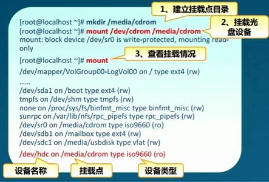
### 卸载
> 卸载已经挂载的文件系统
- umount 存储设备位置
	- umount /dev/chrom
- umount 挂载点目录
	- umount /dirname/

## 自动挂载
> 配置文件：/etc/fstab	否则重启手动设置的挂载会消失
- less /etc/fstab
	- defaults : 挂载参数
	- 0：第一个0；使用dump备份系统时，是否备份文件内的内容；1备份，0不备份
	- 0：第二个0：系统启动时是否检测文件系统；0：不测，1：测；2：稍后检测
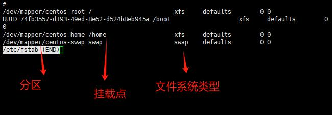


## LVM逻辑卷管理
> 逻辑分区中分出来的逻辑卷；Logical Volume Manager：磁盘用量不够时用到；（不是真是的硬盘，是模拟出来的）

- 基本概念
	- LVM作用
		- 动态调整磁盘容量，（关机后插拔磁盘就不是动态了）
		- 提高磁盘管理的灵活性
		- 使用虚拟的概念管理一定数量的磁盘、或分区。
	- */boot分区不能基于LVM创建*
	- PV概念
		- Physical Volume，物理卷
		- 使用整个硬盘，或者普通分区
		- 由多个默认4M大小的PE基本单元组成；
	- VG
		- Volume Group： 卷组
		- 由一个或者多个PV组成
	- LV
		- Logical Volume：逻辑卷
		- 将卷组分区格式化 -> LV；
		- 可以格式化使用，用于建立文件系统

- 卷管理命令（常用）
	- pvcreate device_name1 [device_name2]；
		- 可以同时创建多个物理卷
		- device_name :分区类型必须要为8e；
	- vgcreate vg_name pv_name1 [pv_name2]
		- 将N个物理卷组成为一个卷组；
	- lvcreate -L 容量大小 -n 逻辑卷名  vg_name
		- 从卷组中指定大小，名称后创建逻辑卷
		- -L 100G
	- lvcreate -l PE数量 -n 逻辑卷名  vg_name
		- -l 可以指定PE数量；每个PE默认4M
			- 不人性- -、
	- lvextend -L +大小 /dev/vg_name/lv_name
		- 注意加号：扩展逻辑卷大小
	- pvscan、vgscan、lvscan
		- 扫描信息
	- pvdisplay、vgdisplay、lvdisplay
		- 查看详细信息
	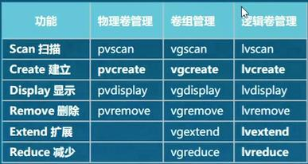
- 案例步骤（新加磁盘空间）
	- 1、创建分区并且将文件系统格式设置为8e；
	- 2、pvcreate
	- 3、vgcreate
	- 4、lvcreate：创建逻辑卷
	- 5、mkfs -t ext4 lv_name （格式化）
	- 6、mkdir /xxx ;如果没有创建待挂载目录；
	- 7、mount /dev/vg_name/lv_name /xxx/ #将格式化过的逻辑卷挂载至指定目录xxx

	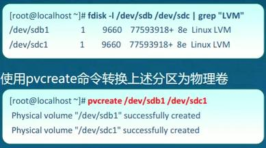
	
- 案例步骤（为逻辑卷扩容）
	- 假设卷组中仍有剩余空间可分配
	- lvextend -L +3G /dev/vg_name/lv_name
		- 扩展
	- df -h 
		- 查看各个磁盘大小，确认修改情况
	- resize2fs /dev/vg_name/lv_name
		- 更新系统文件大小识别
- 案例（卷组空间不足）
	- 添加新磁盘、
	- 创建分区并且将文件系统格式设置为8e；
	- pvcreate
	- vgextend vg_name pv_name1 [pv_name2]
	- lvextend -L 120G /dev/vg_name/lv_name
		- 扩展之后的大小即为120G
	- rerize2fs
	- df -h
```bash
# 减少lv大小，增加vg剩余大小，新建lv，并挂载
[root@localhost ~]# lvreduce -L -60G /dev/centos/home
  WARNING: Reducing active and open logical volume to <348.88 GiB.
  THIS MAY DESTROY YOUR DATA (filesystem etc.)
Do you really want to reduce centos/home? [y/n]: y
  Size of logical volume centos/home changed from <408.88 GiB (104673 extents) to <348.88 GiB (89313 extents).
  Logical volume centos/home successfully resized.
[root@localhost ~]# lvcreate -L 60G -n home2 centos
  Logical volume "home2" created.
  
[root@localhost ~]# mkfs -t ext4 /dev/centos/home2
mke2fs 1.42.9 (28-Dec-2013)
文件系统标签=
OS type: Linux
块大小=4096 (log=2)
分块大小=4096 (log=2)
Stride=0 blocks, Stripe width=0 blocks
3932160 inodes, 15728640 blocks
786432 blocks (5.00%) reserved for the super user
第一个数据块=0
Maximum filesystem blocks=2164260864
480 block groups
32768 blocks per group, 32768 fragments per group
8192 inodes per group
Superblock backups stored on blocks: 
	32768, 98304, 163840, 229376, 294912, 819200, 884736, 1605632, 2654208, 
	4096000, 7962624, 11239424

Allocating group tables: 完成                            
正在写入inode表: 完成                            
Creating journal (32768 blocks): 完成
Writing superblocks and filesystem accounting information: 完成   

[root@localhost ~]# mkdir /home2
[root@localhost ~]# mount /dev/centos/home2 /home2/

# 经过一番磁盘减容操作后，再次重启系统进不去了，总进入安全模式。（其中应该有一个卸载操作，没有进行）
# Authorization not available. Check if polkit service is running or .............
# 然后sudo yum -y install polkit 后重启；又可以了~
```
> 因为逻辑卷，是模拟出来的。所以实际大小可能会有误差，这部分用来存放管理信息；

> 查看磁盘UUID：blkid；相关文件：/etc/fstab
- 扩展命令
	- blkid
		- 查看UUID
	- cp /etc/fstab /etc/fstab.bak
		- 修改前备份习惯；
	- blkid /dev/sda1  >>/etc/fstab
		- 将blkid 查询到的结果追加到fstab文件的末尾
	- df -h
		- 查看磁盘大小
	- pwd
		* 当前路径
		* 