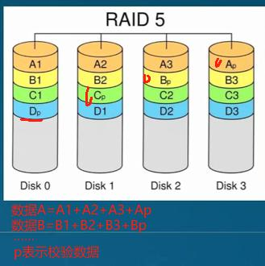
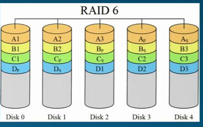
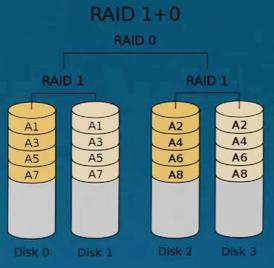
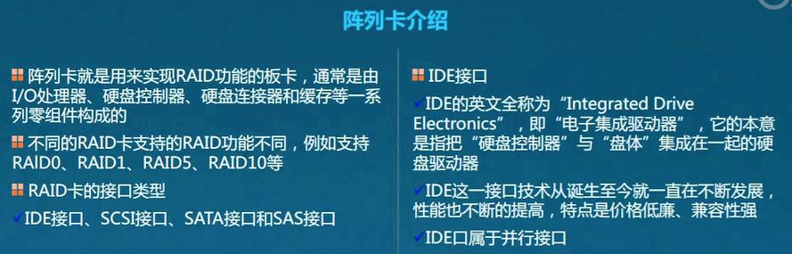
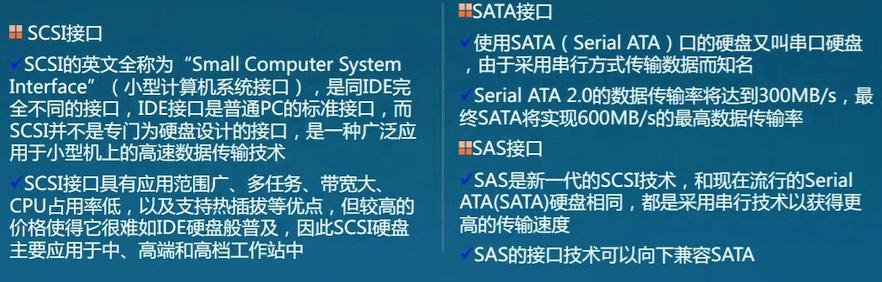
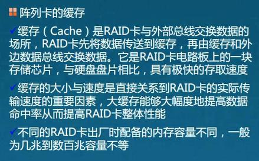
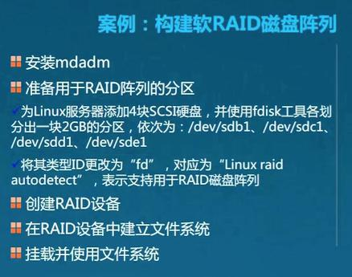
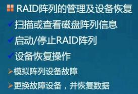

# RAID（磁盘阵列）
## 基础知识
> Redundant Array of Independent DIsks；（独立冗余磁盘阵列）
> 基本一般都要求做RAID；不同的组合方式成为不同的RAID级别；
> 不同的级别，读写速度、安全性、性价比都不同；
> 根据实际情况，选择不同的级别；

- RAID级别（常用）
	- RAID0
		- 以位/字节为单位分隔数据，并行读写，速度快
		- 无数据冗余，因此不算真正的RAID结构
		- 单纯高性能，不保证可靠性，一个磁盘失效，将影响所有数据；
		- 不应用于数据安全性要求高的场合。
	- RAID1
		- 在成对的独立磁盘上产生互为备份数据；（数据冗余）
		- 原数据繁忙时，可以从镜像拷贝中读取数据，因此可提高读取性能；
		- 某盘失效时，会直接切换至镜像；
		- 成本高，安全性、可用性也高。
	- RAID5
		- 由N(至少3)块磁盘组成阵列
		- 一份数据产生(N-1)个条带和一份校验数据，一共N份数据，同时存储在N块硬盘上
			- [切割成N-1份数据 + 1 份校验数据]；
			- 只有一个磁盘损坏时，可以通过其他磁盘和校验数据算出；
				- 允许一块磁盘损坏；
		- 不同的数据产生的校验数据会自动尽量存入到不同磁盘中；
			- 实际上是均衡，循环存放到不同的磁盘中；
		- 多个磁盘可以同时读写(读性能高)
		- 有校验机制（因此相对来说写入性能不高）
		- 实际上有一个磁盘的容量来存放校验数据，因此容量只有N-1;
		- 
	- RAID6（对于5的扩展）
		- 由N(至少4)块磁盘组成阵列
		- 相对RAID5，增加了另外一份独立的校验数据；
			- 可靠性非常高
			- 允许同时损坏两块磁盘；
			- 写入更慢
		- 实际上有两个磁盘的容量来存放校验数据，因此容量只有N-2;
		- 
			- p/q都表示校验数据
	- RAID1+0
		- 由N(至少4)块磁盘组成阵列
		- N块磁盘，两两镜像后，再组成一个RAID0；
		- 容量：N/2;
		- N/2 同时写入，N盘同时读取；
		- 性能高，可靠性高；
		- 
## 阵列卡介绍
> 阵列卡需要通过在机器上执行操作。

## 软构建RAID磁盘阵列
- 创建

- 查看阵列情况
	- cat /proc/mdstat
- 阵列管理
	- 
*其他略过*