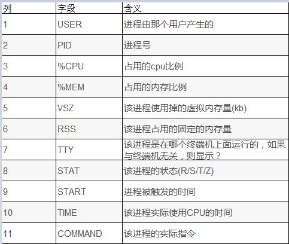
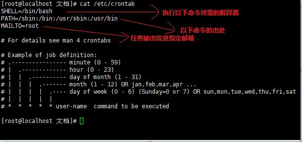
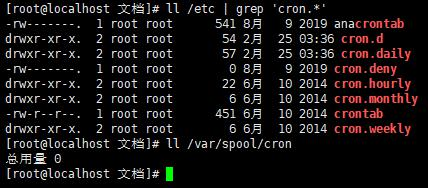
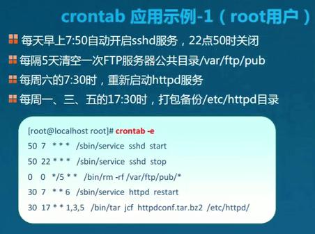
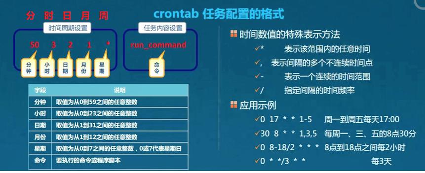

# 进程
- 程序：
	- 可执行的代码和数据；
	- 代码
- 进程：
	- process: => ps;
	- 在CPU和内存中运行的程序代码
	- 动态执行的代码
	- 父子进程
		- 每个进程可以创建一个或者多个进程
###  查看进程（静态）
> 静态的查看进程统计信息；格式1：ps option1  => 例：ps aux；格式2： ps option2
> 不加“-”的方式是借用的unix的写法。之后扩展的带“-”
- option1
	- a: 显示当前终端下所有进程，包括其他用户的进程
	- u: 主要显示用户信息
	- x: 显示当前用户所在终端下的进程信息；
- option2
	- -e: 显示系统所有进程信息
	- -l: 使用长格式显示
	- -f: 使用完整格式显示
	- ps -elf
- 过滤
```bash
ps aux | grep bash

root       883  0.0  0.0 115408   936 ?        S    04:40   0:00 /bin/bash /usr/sbin/ksmtuned
root      9375  0.0  0.0 116864  3372 pts/0    Ss   04:43   0:00 -bash
root      9654  0.0  0.0 112828   976 pts/0    S+   04:58   0:00 grep --color=auto bash  # 过滤的同时，过滤命令也是一个进程

```


###  查看进程（动态）
> 动态、交互式展示当前全部进程、默认情况下3秒刷新一次：格式：top

- 排序（交互命令）
	- P：根据cpu排序
	- M：根据占用内存排序
- pgrep 命令
	- 用途: （ps+grep)根据特定条件查询进程pid
	- -l:  显示进程名
	- -U： 指定特定用户
	- -t： 指定终端
	- ...: 自查 [介绍链接](https://blog.csdn.net/Dontla/article/details/131407327)
	- demo: 
		- pgrep -l -U root -t tty1
		- pgrep -a bash
- pstree 命令
	- 格式： pstree [options] [user_name]
	- 用途：以树形结构列出进程信息；（常用）
	- options:
		- -a: 显示出完整信息
		- -u：列出对应用户名
		- -p：列出对应pid
		- -h: 列出时，标明正在执行的程序
		- -V： 显示版本信息
```bash
pstree -ap root
pstree -p | grep bash 
```
- 进程展示字段的列与含义



## 进程的启动
- 手动启动
	- 前台启动：直接输入命令
	- 后台启动：输入命令+“&”
		- 避免运行时间过长，交给后台去运行
		```bash
		[root@localhost 文档]# vim a &
		[1] 10026
		[root@localhost 文档]# kill 10026
		
		[1]+  已停止               vim a
		# 时间比较长的复制操作等
		```
	- 前后台调度
		- ctrl+z: 挂起进程（将进程放入后台，并停止执行）
		- jobs： 查看处于后台的任务列表；
		- fg [job_num]: 将后台进程恢复到前台运行【指定任务号】
		- ctrl+c： 中断正在执行的命令
		- kill/killall
			- kill [-9] pid: 中断指定id的进程
			- killall [-9] pname：中断进程树
				- -9：此选项用于强制终止
		- pkill命令： 根据特定条件终止进程
			- pkill [-9] -U user_name [-t p_terminal]
			- -U:根据进程所属用户
			- -t：根据进程所在终端
	```bash
	[root@localhost 文档]# jobs
	[1]+  已停止               vim a
	[root@localhost 文档]# vim test1
	
	[2]+  已停止               vim test1
	[root@localhost 文档]# jobs
	[1]-  已停止               vim a 	# -表示次新放入的
	[2]+  已停止               vim test1 # +表示最新放入的
	[root@localhost 文档]# fg 2
	vim test1
	
	[2]+  已停止               vim test1
	
	
	[root@localhost 文档]# vim aa &
	[1] 10279
	[root@localhost 文档]# vim bb &
	[2] 10289
	
	[1]+  已停止               vim aa
	[root@localhost 文档]# jobs
	[1]-  已停止               vim aa
	[2]+  已停止               vim bb
	[root@localhost 文档]# killall vim
	[root@localhost 文档]# jobs
	[1]-  已停止               vim aa
	[2]+  已停止               vim bb
	[root@localhost 文档]# killall -9 vim
	[1]-  已杀死               vim aa
	[root@localhost 文档]# jobs
	[2]+  已杀死               vim bb
	[root@localhost 文档]# killall -9 vim
	vim: no process found

	```
- 调度启动
	- at命令，
		- 一次性计划任务;
		- 服务脚本名称atd，位置=》（ps aux 中的command）
		- 格式1：at [HH:MM] [yyyy-mm-dd]
		- 格式2：now + 5 count ？有五空格
			- count: minutes（分钟）、hours（小时）、days（天）、weeks（星期）
		```bash
		# 案例一：
		date #查看当前时间
		[root@localhost 文档]# at 04:03 2024-07-03	#会自动弹出交互式页面；
		at> rm del	#安排任务(尝试vim无效)
		at> <EOT>	#任务安排完成后，ctrl+d提交任务；之后会有<EOT>标识出现；
		job 1 at Wed Jul  3 04:03:00 2024
		
		
		# 案例二：在某个时间自动关机；
		[root@localhost 文档]# at 04:10	#在当天，不需要输入年月日；
		at> rm del
		at> <EOT>
		job 3 at Wed Jul  3 04:10:00 2024
		[root@localhost 文档]# atq	#查看未执行的任务列表
		3	Wed Jul  3 04:10:00 2024 a root
		[root@localhost 文档]# atrm 3	#删除任务编号；
		[root@localhost 文档]# date
		2024年 07月 03日 星期三 04:08:38 CST

		```
	- crontab命令，
		- 周期性计划任务
		- 可以精确到分（精确到秒的写脚本）
		- 所需服务：crond,由crontab命令来管理；位置=》（ps aux 中的command）
		- 主要配置文件
			- /etc/crontab
				- linux本身用的全局配置文件，不建议修改；
				- 若修改，则重启服务
			- 系统默认设置的位置：/etc/cron.*/
			- 用户自定义的设置： /var/spool/cron/user_name
		
	
	
	
	
	- 管理cron计划任务（增删改查）
		- 格式：crontab [options] [-u user_name] [file_name] 
		- options
			- -e :编辑计划任务，无任务则新增；
				- 应相当于vim /var/spool/cron/user_name,然后重启crond服务
			- -l 查看该用户周期性的计划任务 
				- 应相当于cat /var/spool/cron/user_name
			- -r 删除该用户全部周期性的计划任务
				- 应相当于rm /var/spool/cron/user_name
			- -i 删除计划任务时给出提示
		- file_name
			- 读取文档内容到计划任务中
				- TODO：带尝试
	> 如果只删除一条任务，重新编辑文件，在/var/spool/cron/root文件中删除即可。 (vim或者-e方式)；	
			
	```bash
	[root@localhost 文档]# systemctl status crond #查看服务状态
	[root@localhost 文档]# crontab -e	#进入vim编辑器中编辑任务
	no crontab for root - using an empty one
	crontab: installing new crontab 
	[root@localhost 文档]# ll /var/spool/cron
	总用量 4
	-rw------- 1 root root 1901 7月   3 04:44 root
	[root@localhost 文档]# cat /var/spool/cron/root
	50 * * * * rm /home/healthy/文档/del
	
	```
	 

	
	
	
	

	[crond详解](https://blog.csdn.net/Ruishine/article/details/128550461)